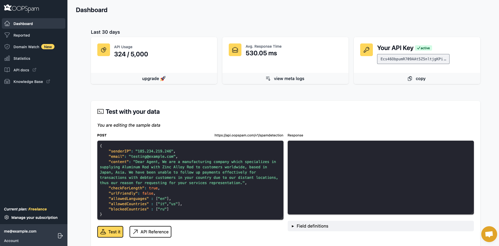
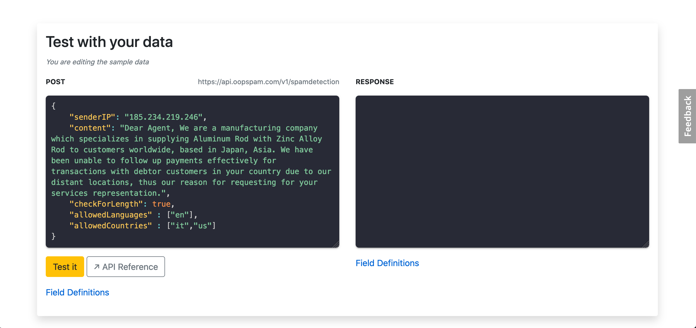
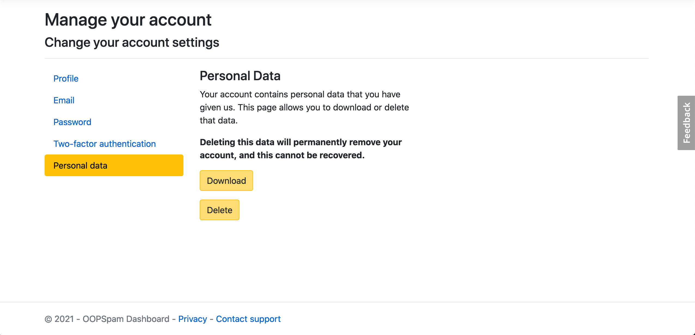
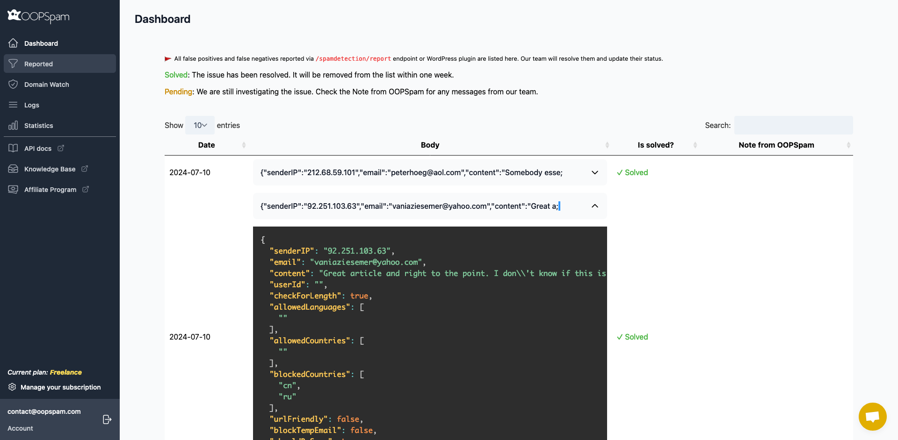
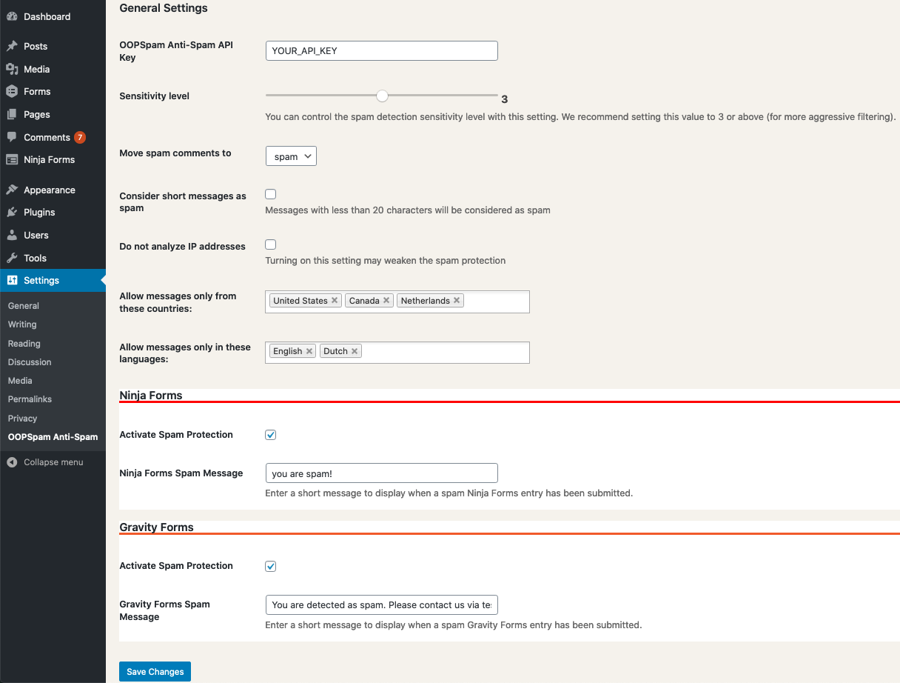
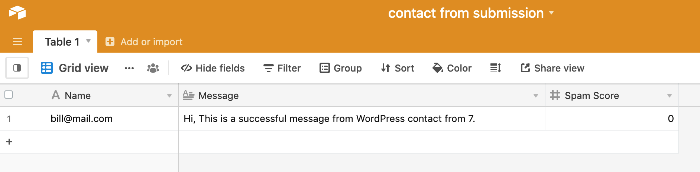
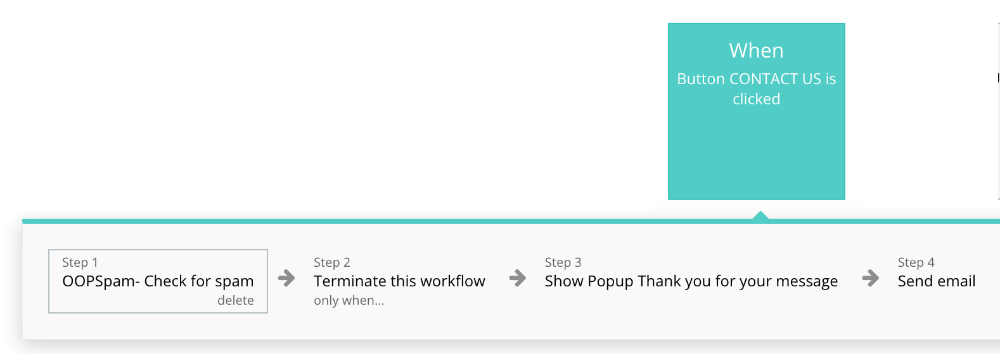

# 👋  Introduction

> BASE URLs

> RapidAPI Marketplace: <a href="https://oopspam.p.rapidapi.com/v1">https://oopspam.p.rapidapi.com/v1</a>

> OOPSpam: <a href="https://api.oopspam.com/v1">https://api.oopspam.com/v1</a>

Welcome to the [OOPSpam API](https://oopspam.com)!

OOPSpam API is a privacy-first and highly accurate anti-spam filter.

<aside>
<div  class="success">
👉 Are you looking for a WordPress plugin? <a href="https://wordpress.org/plugins/oopspam-anti-spam/">Check out OOPSpam in the WordPress Plugin Directory</a>
</div>
</aside>

It is usually used for:

1. Contact forms
2. Comment & Review systems
3. Live & Private chats
4. Email marketing
5. and any platform where message and content exchanged

Submit messages to the API and it will produce Spam ```Score``` with a detailed report. Using ```Score``` you can adjust the sensitivity level (also known as _spam threshold_) of spam filtering to fit your use case.

> Example request body and all possible response fields

```json
{
    "senderIP": "91.203.67.110",
    "email": "testing@example.com",
    "content": "Dear Agent, We are a manufacturing company which specializes in supplying Aluminum Rod with Zinc Alloy Rod to customers worldwide, based in Japan, Asia. We have been unable to follow up payments effectively for transactions with debtor customers in your country due to our distant locations, thus our reason for requesting for your services representation.",
    "checkForLength": true,
    "allowedLanguages" : ["en"],
    "allowedCountries" : ["it","us"]
}
```

```json
{
  "Score": 6,
  "Details": {
    "isIPBlocked": false,
    "isEmailBlocked": true,
    "isContentSpam": "spam",
    "langMatch": true,
    "countryMatch": false,
    "numberOfSpamWords": 1,
    "spamWords": [
      "dear"
    ],
    "isContentTooShort": false
  }
}
```


You can test the API right on your browser with your data on [OOPSpam Dashboard](https://app.oopspam.com/#test-with-your-data) or [the RapidAPI marketplace](https://rapidapi.com/oopspam/api/oopspam-spam-filter).

[](https://app.getpostman.com/run-collection/9739f63cd7bc67da898f?action=collection%2Fimport)

The API is organized around [REST](http://en.wikipedia.org/wiki/Representational_State_Transfer). All requests should be made over SSL. All request and response bodies, including errors, are encoded in JSON.

# 👩‍🏫 Developer Support

As Developers we understand that no API Reference can answer every question.

We have a Developer to Developer support system where if you are working with our API you can speak directly to a developer.

If you have a question about our API just start a conversation with us using the chat widget on this page or via <a href="mailto:contact@oopspam.com">contact@oopspam.com</a>.

# 🔑 Authentication

The OOPSpam API uses API keys to identify and authorize calls. You can register for a new API key in two ways:

1. **Recommended** [Directly on our dashboard](https://app.oopspam.com/Identity/Account/Register)
2. [OOPSpam on RapidAPI marketplace](https://rapidapi.com/oopspam/api/oopspam-spam-filter/)

The account on RapidAPI and on our Dashboard are dissociated. Each of these registration methods has its own base URL and API-KEY. You must therefore adapt your scripts according to your subscription by adapting the URL and your API KEY.

OOPSpam API expects the API key to be included in all API requests to the server in a header that looks like the following:

- For OOPSpam Dashboard endpoint: ```X-Api-Key: API_KEY```
- For RapidAPI endpoint: ```X-Rapidapi-Key: API_KEY```


<aside>
<div  class="success">
👉 Replace <code>API_KEY</code> with your API key
</div>
</aside>

Check out [Using the API via Dashboard](#using-the-api-via-dashboard) and [Using the API via RapidAPI](#using-the-api-via-rapidapi) for additional information.

<aside>
<div class="warning">
🚧 <strong>Keep your API keys secret</strong>

<p>Do not share your API keys in publicly accessible areas or put them in version control or client-side code. It's a good practice to set secrets like the API key as environment variable and then read it in the code.</p>
</div>
</aside>

## Using the API via Dashboard

The base URL : `https://api.oopspam.com/v1`

If you decided to subscribe directly on our site, you have [OOPSpam Dashboard](https://app.oopspam.com/Identity/Account/Register) at your disposal.

It allows you to:

- To follow your consumption in real time
- Manage your subscription and change it if necessary
- Test the endpoint without writing a line of code.

<aside>
<div class="success">
👉 Make sure to include <code>X-Api-Key: API_KEY</code> in a request header and replace <code>API_KEY</code> with your API key.
</div>
</aside>





## Using the API via RapidAPI

The base URL : `https://oopspam.p.rapidapi.com/v1`

<aside>
<div class="notice">
ℹ️ <strong>What is RapidAPI?</strong>
<p> RapidAPI, the world's largest API Marketplace, is used by over one million developers to find, test, and connect to thousands of > APIs — all with a single account, API Key, and SDK. You can learn more about it <a href="https://docs.rapidapi.com/docs/what-is-rapidapi">here</a>. </p>
</div>
</aside>

If you decided to subscribe to the API via [RapidAPI marketplace](https://rapidapi.com/oopspam/api/oopspam-spam-filter/) then all information related to your subscription are available on the RapidAPI developer dashboard.

The RapidAPI developer dashboard is where you can see all of your apps, locate API keys, view analytics, and manage billing settings.

To access the dashboard, simply login to RapidAPI and select 'My Apps' in the top-right menu. Alternatively, you can head directly to [https://rapidapi.com/developer/dashboard](https://rapidapi.com/developer/dashboard).

In the main dashboard, you will see account-wide analytics and account information. To get more detailed information, you can select tabs on the left-hand side of the screen.

### App Specific Analytics

Using the RapidAPI dashboard, you can also view analytics specific to each app in your account. To do so, switch over to the 'Analytics' tab of your application in the dashboard.

On the top of the page, you'll be able to see:

- A chart with all the calls being made to the API
- Logs with all the request data

In each graph, you can view the following metrics:

- ```API Calls```: how many requests are being made
- ```Error rates```: how many requests are error some
- ```Latency```: how long (on average) requests take to execute

You can find your API KEY under 'Security' tab.


# 🚦 Rate Limiting

> Headers via OOPSpam endpoint

```sass
X-RateLimit-Limit: 1000
X-RateLimit-Remaining: 998
```

> Headers via RapidAPI endpoint

```sass
x-ratelimit-requests-limit: 40
x-ratelimit-requests-remaining: 1
```

Depending on your subscription, limits are placed on the number of API requests you may make using your API key.
All responses from the API contain information about remaining and total rate limit. The special ```X-RateLimit-```
headers have the following meaning:

Header | Description
--------- | -----------
```X-RateLimit-Limit``` ```x-ratelimit-requests-limit``` |  The number of requests per month for the plan you are currently subscribed
```X-RateLimit-Remaining``` ```x-ratelimit-requests-remaining``` |  The number of requests remaining before you reach the limit of requests your application is allowed to make
```x-ratelimit-requests-reset``` |  Time at which the request counter is reset. Available only to RapidAPI endpoint

If you exceeds this threshold your application will be unable to make further requests until the rate limit resets.

<aside>
<div class="notice">
ℹ️ <strong>How Do I See My Current Usage?</strong>
<p>Besides the above headers, you can see your API usage via RapidAPI Developer dashboard and OOPSpam Dashboard according to your subscription.</p>
</div>
</aside>

#  🎯 Endpoints

## Spam Detection

> Example request

```ruby
require 'uri'
require 'net/http'
require 'openssl'

# Make sure to use correct base URL
#url = URI("https://oopspam.p.rapidapi.com/v1/spamdetection")
url = URI("https://api.oopspam.com/v1/spamdetection")

http = Net::HTTP.new(url.host, url.port)
http.use_ssl = true
http.verify_mode = OpenSSL::SSL::VERIFY_NONE

request = Net::HTTP::Post.new(url)
request["content-type"] = 'application/json'

# Make sure to use correct HEADERS based on your endpoint
#request["x-rapidapi-key"] = 'YOUR_API_KEY'
#request["x-rapidapi-host"] = 'oopspam.p.rapidapi.com'
request["X-Api-Key"] = 'YOUR_API_KEY'

request.body = "{\n \"checkForLength\": true,\n \"content\": \"Dear Agent, We are a manufacturing company which specializes in supplying Aluminum Rod with Zinc Alloy Rod to customers worldwide, based in Japan, Asia. We have been unable to follow up payments effectively for transactions with debtor customers in your country due to our distant locations, thus our reason for requesting for your services representation.\",\n  \"senderIP\": \"185.234.219.246\",\n  \"email\": \"testing@example.com\"\n}"

response = http.request(request)
puts response.read_body
```

```python
import requests

# Make sure to use correct base URL
#url = "https://oopspam.p.rapidapi.com/v1/spamdetection"
url = "https://api.oopspam.com/v1/spamdetection"

payload = "{\n \"checkForLength\": true,\n \"content\": \"Dear Agent, We are a manufacturing company which specializes in supplying Aluminum Rod with Zinc Alloy Rod to customers worldwide, based in Japan, Asia. We have been unable to follow up payments effectively for transactions with debtor customers in your country due to our distant locations, thus our reason for requesting for your services representation.\",\n  \"senderIP\": \"185.234.219.246\",\n  \"email\": \"testing@example.com\"\n}"

# Make sure to use correct HEADERS based on your endpoint
headers = {
    'content-type': "application/json",
    'X-Api-Key': "YOUR_API_KEY",
    #'x-rapidapi-key': "YOUR_API_KEY",
    #'x-rapidapi-host': "oopspam.p.rapidapi.com"
    }

response = requests.request("POST", url, data=payload, headers=headers)

print(response.text)
```

```shell
curl --request POST \
# Make sure to use correct base URL
 --url https://api.oopspam.com/v1/spamdetection \
#	--url https://oopspam.p.rapidapi.com/v1/spamdetection \
	--header 'content-type: application/json' \
# Make sure to use correct HEADERS based on your endpoint
    --header 'X-Api-Key: YOUR_API_KEY'
#	--header 'x-rapidapi-host: oopspam.p.rapidapi.com' \
#	--header 'x-rapidapi-key: YOUR_API_KEY' \
	--data '{
    "checkForLength": true,
    "content": "Dear Agent, We are a manufacturing company which specializes in supplying Aluminum Rod with Zinc Alloy Rod to customers worldwide, based in Japan, Asia. We have been unable to follow up payments effectively for transactions with debtor customers in your country due to our distant locations, thus our reason for requesting for your services representation.",
    "senderIP": "185.234.219.246",
    "email": "testing@example.com",
    "allowedCountries": [
        "it",
        "us"
    ],
    "allowedLanguages": [
        "en"
    ]
}'
```

```javascript
const data = JSON.stringify({
	"checkForLength": true,
	"content": "Dear Agent, We are a manufacturing company which specializes in supplying Aluminum Rod with Zinc Alloy Rod to customers worldwide, based in Japan, Asia. We have been unable to follow up payments effectively for transactions with debtor customers in your country due to our distant locations, thus our reason for requesting for your services representation.",
	"senderIP": "185.234.219.246",
    "email": "testing@example.com",
  "allowedCountries": [
		"it",
		"us"
	],
	"allowedLanguages": [
		"en"
	]
});

const xhr = new XMLHttpRequest();
xhr.withCredentials = true;

xhr.addEventListener("readystatechange", function () {
	if (this.readyState === this.DONE) {
		console.log(this.responseText);
	}
});

// Make sure to use correct base URL
//xhr.open("POST", "https://oopspam.p.rapidapi.com/v1/spamdetection");
 xhr.open("POST", "https://api.oopspam.com/v1/spamdetection");

xhr.setRequestHeader("content-type", "application/json");

// Make sure to use correct HEADERS based on your endpoint
   xhr.setRequestHeader("X-Api-Key", "YOUR_API_KEY");
// xhr.setRequestHeader("x-rapidapi-key", "YOUR_API_KEY");
// xhr.setRequestHeader("x-rapidapi-host", "oopspam.p.rapidapi.com");

xhr.send(data);
```

```java
HttpRequest request = HttpRequest.newBuilder()
//  Make sure to use correct base URL
//      .uri(URI.create("https://oopspam.p.rapidapi.com/v1/spamdetection"))
		.uri(URI.create("https://api.oopspam.com/v1/spamdetection"))
		.header("content-type", "application/json")
    // Make sure to use correct HEADERS based on your endpoint
        .header("X-Api-Key", "YOUR_API_KEY")
//	    .header("x-rapidapi-key", "YOUR_API_KEY")
//		.header("x-rapidapi-host", "oopspam.p.rapidapi.com")
		.method("POST", HttpRequest.BodyPublishers.ofString("{\n \"checkForLength\": true,\n \"content\": \"Dear Agent, We are a manufacturing company which specializes in supplying Aluminum Rod with Zinc Alloy Rod to customers worldwide, based in Japan, Asia. We have been unable to follow up payments effectively for transactions with debtor customers in your country due to our distant locations, thus our reason for requesting for your services representation.\",\n  \"senderIP\": \"185.234.219.246\",\n  \"email\": \"testing@example.com\"\n}"))
		.build();
HttpResponse<String> response = HttpClient.newHttpClient().send(request, HttpResponse.BodyHandlers.ofString());
System.out.println(response.body());
```

```csharp
//  Make sure to use correct base URL
   var client = new RestClient("https://api.oopspam.com/v1/spamdetection");
// var client = new RestClient("https://oopspam.p.rapidapi.com/v1/spamdetection");

var request = new RestRequest(Method.POST);
request.AddHeader("content-type", "application/json");
// Make sure to use correct HEADERS based on your endpoint
request.AddHeader("X-Api-Key", "YOUR_API_KEY");
// request.AddHeader("x-rapidapi-key", "YOUR_API_KEY");
// request.AddHeader("x-rapidapi-host", "oopspam.p.rapidapi.com");
request.AddParameter("application/json", "{\n \"checkForLength\": true,\n \"content\": \"Dear Agent, We are a manufacturing company which specializes in supplying Aluminum Rod with Zinc Alloy Rod to customers worldwide, based in Japan, Asia. We have been unable to follow up payments effectively for transactions with debtor customers in your country due to our distant locations, thus our reason for requesting for your services representation.\",\n  \"senderIP\": \"185.234.219.246\",\n  \"email\": \"testing@example.com\"\n}", ParameterType.RequestBody);
IRestResponse response = client.Execute(request);
```

```go
package main

import (
	"fmt"
	"strings"
	"net/http"
	"io/ioutil"
)

func main() {

// Make sure to use correct base URL
    url := "https://api.oopspam.com/v1/spamdetection"
//	url := "https://oopspam.p.rapidapi.com/v1/spamdetection"

	payload := strings.NewReader("{\n \"checkForLength\": true,\n \"content\": \"Dear Agent, We are a manufacturing company which specializes in supplying Aluminum Rod with Zinc Alloy Rod to customers worldwide, based in Japan, Asia. We have been unable to follow up payments effectively for transactions with debtor customers in your country due to our distant locations, thus our reason for requesting for your services representation.\",\n  \"senderIP\": \"185.234.219.246\",\n  \"email\": \"testing@example.com\"\n}")

	req, _ := http.NewRequest("POST", url, payload)

	req.Header.Add("content-type", "application/json")
// Make sure to use correct HEADERS based on your endpoint
    req.Header.Add("X-Api-Key", "YOUR_API_KEY")
//	req.Header.Add("x-rapidapi-key", "YOUR_API_KEY")
//	req.Header.Add("x-rapidapi-host", "oopspam.p.rapidapi.com")

	res, _ := http.DefaultClient.Do(req)

	defer res.Body.Close()
	body, _ := ioutil.ReadAll(res.Body)

	fmt.Println(res)
	fmt.Println(string(body))

}
```

```php
<?php

$client = new http\Client;
$request = new http\Client\Request;

$body = new http\Message\Body;
$body->append('{
    "checkForLength": true,
    "content": "Dear Agent, We are a manufacturing company which specializes in supplying Aluminum Rod with Zinc Alloy Rod to customers worldwide, based in Japan, Asia. We have been unable to follow up payments effectively for transactions with debtor customers in your country due to our distant locations, thus our reason for requesting for your services representation.",
    "senderIP": "185.234.219.246",
    "email": "testing@example.com",
}');

// Make sure to use correct base URL
$request->setRequestUrl('https://api.oopspam.com/v1/spamdetection');
// $request->setRequestUrl('https://oopspam.p.rapidapi.com/v1/spamdetection');
$request->setRequestMethod('POST');
$request->setBody($body);

// Make sure to use correct HEADERS based on your endpoint
$request->setHeaders([
	'content-type' => 'application/json',
	'X-Api-Key' => 'YOUR_API_KEY'
]);
// $request->setHeaders([
// 	'content-type' => 'application/json',
// 	'x-rapidapi-key' => 'YOUR_API_KEY',
// 	'x-rapidapi-host' => 'oopspam.p.rapidapi.com'
// ]);

$client->enqueue($request)->send();
$response = $client->getResponse();

echo $response->getBody();
```

> The above command may return JSON structured like this:

```json
{
  "Score": 6,
  "Details": {
    "isIPBlocked": true,
    "isEmailBlocked": true,
    "isContentSpam": "spam",
    "langMatch": true,
    "countryMatch": false,
    "numberOfSpamWords": 1,
    "spamWords": [
      "dear"
    ],
    "isContentTooShort": false
  }
}
```

> Note that OOPSpam API tries to return the result as soon as one of the analyses detects spam. Hence some fields may not appear in the response body. Say ```senderIP``` is blocked then it will return following response without doing other analyses:

```json
{
  "Score": 6,
  "Details": {
    "isIPBlocked": true,
    "isContentTooShort": false
  }
}
```

The endpoint analyses given parameters and returns overall spam score (```Score```) including detailed detection results in structured JSON.

[](https://app.getpostman.com/run-collection/9739f63cd7bc67da898f?action=collection%2Fimport)

### HTTP Request

`POST /spamdetection`

<aside>
<div  class="success">
👉 <strong>Reminder - the base URLs</strong>
<p>You can consume OOPSpam API via RapidAPI Marketplace or directly through our dashboard. The base URL varies depending on which platform you are using. Here are the endpoints:</p>
<ul>
<li>OOPSpam: <code>https://api.oopspam.com/v1</code></li>
<li>RapidAPI: <code>https://oopspam.p.rapidapi.com/v1</code></li>
</ul>
</div>
</aside>

### Request Body Parameters

<table class="table">
                  <thead>
                  <tr>
                      <th scope="col">Field</th>
                      <th scope="col">Definition</th>
                  </tr>
                  </thead>
                  <tbody>
                   <tr>
                        <td><code>content</code></td>
                      <td><strong>string (required)</strong> Is a content/message you would like to be analyzed.</td>
                    </tr>
                    <tr>
                      <td><code>senderIP</code></td>
                        <td><strong>string (optional)</strong> Is the IP address of the original content/message sender. This field value will be looked up in multiple denylist IP lists that previously detected sending spam. Although <code>senderIP</code> is an optional field, we recommend sending it.
                            <p><strong>Important:</strong> </p>
                            <ul>
                                <li>This field should include spammer's IP, in other words, whoever submitted regarding content to you, not your IP.</li>
                                <li>IP addresses <i>127.0.0.1</i>, <i>1.1.1.1</i>, <i>::1</i> including private IPs are by default blocked.</li>
                            </ul>
                            </td>
                    </tr>
                     <tr>
                      <td><code>email</code></td>
                        <td><strong>string (optional)</strong> Is the email address of the original content/message sender. This field value will be looked up in multiple denylist email lists that previously detected sending spam. Although <code>email</code> is an optional field, we recommend sending it.
                            <p><strong>Important:</strong> </p>
                            <ul>
                                <li>This field should include spammer's email, in other words, whoever submitted regarding content to you, not your email.</li>
                            </ul>
                            </td>
                    </tr>
                  <tr>
                      <td><code>checkForLength</code> <small style="background-color: #fbcf50;">default:true</small></td>
                      <td><strong>boolean (optional)</strong> If the content is shorter than 20 characters, it will be considered spam (<code>Score: 5</code>) and returns <code>isContentTooShort: true</code>.</td>
                  </tr>
                  <tr>
                      <td><code>allowedLanguages</code></td>
                      <td><strong>array (optional)</strong> This allows blocking content based on a content language. Let us know in what language(s) you expect the content to be by passing <a href="#iso-639">two-letter language(s) code</a> to the parameter as an array.</td>
                  </tr>
                  <tr>
                      <td><code>allowedCountries</code></td>
                      <td><strong>array (optional)</strong> Allow content only from a certain country or countries. All you need to do is pass <a target="_blank" href="https://en.wikipedia.org/wiki/ISO_3166-1_alpha-2#Officially_assigned_code_elements">the two-letter country code</a> as an array.
                          <p><strong>Important:</strong> </p>
                          <code>senderIP</code> is required for this to work. </td>
                      </tr>
                  </tbody>
                </table>

### Response Body Parameters

<table class="table">
                            <thead>
                            <tr>
                                <th scope="col">Field</th>
                                <th scope="col">Definition</th>
                            </tr>
                            </thead>
                            <tbody>
                            <tr>
                                <td><code>Score</code></td>
                                <td><strong>number</strong> - A value between 0-6 representing an overall spam score based on passed parameters. The higher this value, the more likely to be spam.
                                <aside  >
                                <div class="success">
                            👉 While it depends on a use case, usually a <code>Score</code> 3 or higher can be considered spam.</div></aside>
                                </td>
                            </tr>
                            <tr>
                                <td><code>Details</code></td>
                                <td>A dictionary containing the result of different analyses. </td>
                            </tr>
                            <tr>
                                <td><code>isIPBlocked</code></td>
                                <td><strong>boolean</strong> - Represents whether the value of parameter <code>senderIP</code> is blocked.</td>
                            </tr>
                            <tr>
                                <td><code>isEmailBlocked</code></td>
                                <td><strong>boolean</strong> - Represents whether the value of parameter <code>email</code> is blocked.</td>
                            </tr>
                            <tr>
                                <td><code>langMatch</code></td>
                                <td><strong>boolean</strong> - Represents whether the value of parameter <code>allowedLanguages</code> matches with the detected language by Language Detection algorithm.</td>
                            </tr>
                            <tr>
                                <td><code>isContentSpam</code></td>
                                <td><strong>string</strong> - Represents the result of a Machine Learning algorithm on whether the content is a <i>spam</i> or <i>nospam</i>.</td>
                            </tr>
                            <tr>
                                <td><code>numberOfSpamWords</code></td>
                                <td><strong>number</strong> - A value representing a number of spam words within the content.</td>
                            </tr>
                             <tr>
                                <td><code>spamWords</code></td>
                                <td><strong>array</strong> - A value representing the top 10 spam words in a content</td>
                            </tr>
                            <tr>
                                <td><code>isContentTooShort</code></td>
                                <td><strong>boolean</strong> - Represents whether the value of parameter <code>content</code> is too short (max. 20 characters) to be considered a meaningful sentence. Any content that is too short will be considered spam. </td>
                            </tr>
                            <tr>
                                <td><code>countryMatch</code></td>
                                <td><strong>boolean</strong> - Represents whether an IP address (the value of <code>senderIP</code>) originates from one of the countries you passed through <code>allowedCountries</code> parameter. In case of a mismatch, the API returns the maximum spam <code>Score</code> of 6. </td>
                            </tr>
                            </tbody>
                        </table>


<details id="iso-639"><summary>See support language codes for <code>allowedLanguages</code> field</summary>
<div style="padding-top:1em;">

<table class="table">
                            <thead>
                                <tr>
                                    <th><strong>Language</strong></th>
                                    <th>ISO 639-1 code</th>
                                    <th>Language</th>
                                    <th>ISO 639-1 code</th>
                                </tr>
                            </thead>
                            <tbody>
                                <tr>
                                    <td>Afrikaans</td>
                                    <td><em>af</em></td>
                                    <td>Japanese</td>
                                    <td><em>ja</em></td>
                                </tr>
                                <tr>
                                    <td>Albanian</td>
                                    <td><em>sq</em></td>
                                    <td>Korean</td>
                                    <td><em>ko</em></td>
                                </tr>
                                <tr>
                                    <td>Arabic</td>
                                    <td><em>ar</em></td>
                                    <td>Latin</td>
                                    <td><em>la</em></td>
                                </tr>
                                <tr>
                                    <td>Basque</td>
                                    <td><em>eu</em></td>
                                    <td>Latvian</td>
                                    <td><em>lv</em></td>
                                </tr>
                                <tr>
                                    <td>Belarusian</td>
                                    <td><em>be</em></td>
                                    <td>Lithuanian</td>
                                    <td><em>lt</em></td>
                                </tr>
                                <tr>
                                    <td>Bengali</td>
                                    <td><em>bn</em></td>
                                    <td>Malay</td>
                                    <td><em>ms</em></td>
                                </tr>
                                <tr>
                                    <td>Bokmal</td>
                                    <td><em>nb</em></td>
                                    <td>Norwegian</td>
                                    <td><em>no</em></td>
                                </tr>
                                <tr>
                                    <td>Bulgarian</td>
                                    <td><em>bg</em></td>
                                    <td>Nynorsk</td>
                                    <td><em>nn</em></td>
                                </tr>
                                <tr>
                                    <td>Catalan</td>
                                    <td><em>ca</em></td>
                                    <td>Persian</td>
                                    <td><em>fa</em></td>
                                </tr>
                                <tr>
                                    <td>Chinese</td>
                                    <td><em>zh</em></td>
                                    <td>Polish</td>
                                    <td><em>pl</em></td>
                                </tr>
                                <tr>
                                    <td>Croatian</td>
                                    <td><em>hr</em></td>
                                    <td>Portuguese</td>
                                    <td><em>pt</em></td>
                                </tr>
                                <tr>
                                    <td>Czech</td>
                                    <td><em>cs</em></td>
                                    <td>Punjabi</td>
                                    <td><em>pa</em></td>
                                </tr>
                                <tr>
                                    <td>Danish</td>
                                    <td><em>da</em></td>
                                    <td>Romanian</td>
                                    <td><em>ro</em></td>
                                </tr>
                                <tr>
                                    <td>Dutch</td>
                                    <td><em>nl</em></td>
                                    <td>Russian</td>
                                    <td><em>ru</em></td>
                                </tr>
                                <tr>
                                    <td>English</td>
                                    <td><em>en</em></td>
                                    <td>Slovak</td>
                                    <td><em>sk</em></td>
                                </tr>
                                <tr>
                                    <td>Estonian</td>
                                    <td><em>et</em></td>
                                    <td>Slovene</td>
                                    <td><em>sl</em></td>
                                </tr>
                                <tr>
                                    <td>Finnish</td>
                                    <td><em>fi</em></td>
                                    <td>Somali</td>
                                    <td><em>so</em></td>
                                </tr>
                                <tr>
                                    <td>French</td>
                                    <td><em>fr</em></td>
                                    <td>Spanish</td>
                                    <td><em>es</em></td>
                                </tr>
                                <tr>
                                    <td>German</td>
                                    <td><em>de</em></td>
                                    <td>Swedish</td>
                                    <td><em>sv</em></td>
                                </tr>
                                <tr>
                                    <td>Greek</td>
                                    <td><em>el</em></td>
                                    <td>Tagalog</td>
                                    <td><em>tl</em></td>
                                </tr>
                                <tr>
                                    <td>Gujarati</td>
                                    <td><em>gu</em></td>
                                    <td>Tamil</td>
                                    <td><em>ta</em></td>
                                </tr>
                                <tr>
                                    <td>Hebrew</td>
                                    <td><em>he</em></td>
                                    <td>Telugu</td>
                                    <td><em>te</em></td>
                                </tr>
                                <tr>
                                    <td>Hindi</td>
                                    <td><em>hi</em></td>
                                    <td>Thai</td>
                                    <td><em>th</em></td>
                                </tr>
                                <tr>
                                    <td>Hungarian</td>
                                    <td><em>hu</em></td>
                                    <td>Turkish</td>
                                    <td><em>tr</em></td>
                                </tr>
                                <tr>
                                    <td>Icelandic</td>
                                    <td><em>is</em></td>
                                    <td>Urdu</td>
                                    <td><em>ur</em></td>
                                </tr>
                                <tr>
                                    <td>Indonesian</td>
                                    <td><em>id</em></td>
                                    <td>Vietnamese</td>
                                    <td><em>vi</em></td>
                                </tr>
                                <tr>
                                    <td>Irish</td>
                                    <td><em>ga</em></td>
                                    <td>Welsh</td>
                                    <td><em>cy</em></td>
                                </tr>
                                <tr>
                                    <td>Italian</td>
                                    <td><em>it</em></td>
                                    <td></td>
                                </tr>
                            </tbody>
                        </table>

</div>
</details>

## Report

You can use this endpoint to report any false positives and false negatives to us. All the submissions will be available on [OOPSpam Dashboard](https://app.oopspam.com/) under the Reported page. The status of each report will be either <span style="color:green">Solved</span> or <span style="color:orange">Pending</span>. We then analyze them and improve detection for your use case. Every processed submission will be marked as <span style="color:green">Solved</span>.

### HTTP Request

> Example request and response body

```json
{
    "senderIP": "91.203.67.110",
    "email": "testing@example.com",
    "content": "Dear Agent, We are a manufacturing company which specializes in supplying Aluminum Rod with Zinc Alloy Rod to customers worldwide, based in Japan, Asia. We have been unable to follow up payments effectively for transactions with debtor customers in your country due to our distant locations, thus our reason for requesting for your services representation.",
    "checkForLength": true,
    "allowedLanguages" : ["en"],
    "allowedCountries" : ["it","us"],
    "shouldBeSpam": true
}
```

```json
{
  "message": "success"
}
```

`POST /spamdetection/report`

The request body is identical to [/spamdetection](#spam-detection) endpoint. The only difference is an extra boolean field `shouldBeSpam` which takes the value of `true` or `false`. This field tells us if a content is false negative or false positive.

<table class="table">
                  <thead>
                  <tr>
                      <th scope="col">Field</th>
                      <th scope="col">Definition</th>
                  </tr>
                  </thead>
                  <tbody>
                   <tr>
                        <td><code>shouldBeSpam</code></td>
                      <td><strong>boolean (required)</strong> A value represents whether the reported misdetection should be spam or ham. Pass <code>true</code> for spam, <code>false</code> for ham.</td>
                    </tr>
                    </tbody>
                    </table>

Here is an example listing on the dashboard:



# 🔌 3rd Party Integration

You can integrate OOPSpam API with any platform where message is exchanged using HTTP. While we try to integrate it into the different platforms, our main focus is to put more work on development, improvements, and documentation/tutorials. If you integrate OOPSpam into any platform, [let us know](#developer-support). We'd be happy to publish it here.

## WordPress

OOPSpam has [a WordPress plugin](https://wordpress.org/plugins/oopspam-anti-spam/) that integrates with the API. It filters both comments and contact form submissions.

### Supported solutions

- Ninja Forms
- Gravity Forms
- Contact Form 7
- Elementor Forms
- Fluent Forms
- WPForms
- Formidable Forms
- GiveWP donation forms
- WooCommerce Order and Registration

As the plugin works with OOPSpam API, it supports all spam protection capabilities out of the box.

The plugin currently supports the following settings:

- Sensitivity level adjustment
- Do not analyze IP addresses
- Country Restrictions
- Language Restrictions
- and other settings



## Make (formerly Integromat)

[Make](https://www.make.com/en?utm_source=oopspam&utm_medium=partner&utm_campaign=oopspam-partner-program) (similar to Zapier) is a visual automation platform that lets you send information between OOPSpam API and thousands of apps with just a few clicks. All you have to do is drop [OOPSpam Make App](https://www.make.com/en/integrations/oopspam-anti-spam) to your scenario and enter API key.

Let's look at the following example.


On this scenario, we add and connect Contact Form 7, OOPSpam Anti-Spam and Airtable apps.

1. Contact Form 7 app receives form submissions and passes data to OOPSpam app.
2. OOPSpam analyzes and passes the spam score to the filter between OOPSpam and Airtable app.
3. Filter allows data to be passed to Airtable app only if the spam score is less than 3.
4. Airtable receives data and insert it to a spreadsheet.
5. ✅ Done!



Every contact form, comment, email and chat apps on Make can be connect in similar fashion.

## Zapier

Reach out to us via <a href="mailto:contact@oopspam.com">contact@oopspam.com</a> to get an invite to our Zapier app.

## Bubble.io

[OOPSpam Bubble plugin](https://bubble.io/plugin/oopspam-spam-detection-1582908608700x936823858020745200) can be used to block spam registration and contact form submissions.
Here is an example how you can use the plugin to stop spam on your Bubble contact forms.



Check out [How to set up OOPSpam with Bubble.io app](https://www.oopspam.com/blog/spam-protection-for-bubble.io) article for more information.

# 💡 Tips

- Responded ```Score``` parameter value ranges from 0 to 6. A value 3 or higher can be considered spam.
- Make async HTTP request instead of sync as the system check ```senderIP``` against multiple denylist IP lists until it finds it.
- Don't send 127.0.0.1, ::1, 1.1.1.1 including private IPs as a value of ```senderIP```, they are by default blocked.