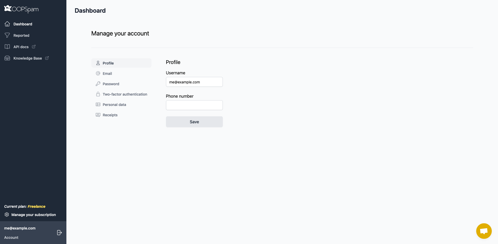

# 👋  Introduction

> BASE URLs

> OOPSpam: <a href="https://api.oopspam.com/v1">https://api.oopspam.com/v1</a>

> RapidAPI Marketplace: <a href="https://oopspam.p.rapidapi.com/v1">https://oopspam.p.rapidapi.com/v1</a>

Welcome to the [OOPSpam API](https://oopspam.com)!

OOPSpam API is a privacy-first and highly accurate anti-spam filter.

<aside>
<div  class="success">
👉 Are you looking for a WordPress plugin? <a href="https://wordpress.org/plugins/oopspam-anti-spam/">Check out OOPSpam in the WordPress Plugin Directory</a>
</div>
</aside>

It is usually used for:

1. Contact forms
2. Comment & Review systems
3. Live & Private chats
4. Email marketing
5. Sign up protection (from fake accounts)
6. E-commerce card-testing attack & chargeback protection
7. and any platform where messages and content are exchanged

Submit messages to the API and it will generate a spam ```Score``` with a detailed report. Using the ```Score``` you can adjust the sensitivity level (also known as _spam threshold_) of spam filtering to suit your use case. Our recommendation is to consider Score:3 and higher as spam, and anything lower than that should be considered ham (not spam).

> Example request body and all possible response fields

```json
{
    "senderIP": "91.203.67.110",
    "email": "testing@example.com",
    "content": "Dear Agent, We are a manufacturing company which specializes in supplying Aluminum Rod with Zinc Alloy Rod to customers worldwide, based in Japan, Asia. We have been unable to follow up payments effectively for transactions with debtor customers in your country due to our distant locations, thus our reason for requesting for your services representation.",
    "blockTempEmail": false,
    "logIt": false,
    "checkForLength": true,
    "urlFriendly": false,
    "allowedLanguages" : ["en"],
    "allowedCountries" : ["it","us"],
    "blockedCountries" : ["ru","cn"]
}
```

```json
{
  "Score": 6,
  "Details": {
    "isIPBlocked": false,
    "isEmailBlocked": true,
    "isContentSpam": "spam",
    "langMatch": true,
    "countryMatch": false,
    "numberOfSpamWords": 1,
    "spamWords": [
      "dear"
    ],
    "isContentTooShort": false
  }
}
```


You can test the API directly in your browser with your data on the [OOPSpam Dashboard](https://app.oopspam.com/#test-with-your-data) or [the RapidAPI Marketplace](https://rapidapi.com/oopspam/api/oopspam-spam-filter).


[](https://god.gw.postman.com/run-collection/14518409-422afe44-9793-4a24-aaee-e0d47e083234?action=collection%2Ffork&source=rip_markdown&collection-url=entityId%3D14518409-422afe44-9793-4a24-aaee-e0d47e083234%26entityType%3Dcollection%26workspaceId%3D73b5fac9-5b29-4680-9bb8-47a1a4768457)

[](https://insomnia.rest/run/?label=&uri=https%3A%2F%2Fwww.oopspam.com%2Fdocs%2Fimages%2Fscreenshots%2FOOPSpam_API.json)

The API is built around [REST](http://en.wikipedia.org/wiki/Representational_State_Transfer). All requests should be made over SSL. All request and response bodies, including errors, are encoded in JSON.

# 👩‍🏫 Developer Support

As Developers we understand that no API Reference can answer every question.

We have a Developer to Developer support system where if you are working with our API you can speak directly to a developer.

If you have a question about our API just start a conversation with us using the chat widget on this page or via <a href="mailto:contact@oopspam.com">contact@oopspam.com</a>.

# 🔑 Authentication

The OOPSpam API uses API keys to identify and authorize calls. You can register for a new API key in two ways:

1. **Recommended** [Directly on our dashboard](https://app.oopspam.com/Identity/Account/Register)
2. [OOPSpam on RapidAPI marketplace](https://rapidapi.com/oopspam/api/oopspam-spam-filter/)

The account on RapidAPI and on our Dashboard are dissociated. Each of these registration methods has its own base URL and API-KEY. You must therefore adapt your scripts according to your subscription by adapting the URL and your API KEY.

The OOPSpam API expects the API key to be included in all API requests to the server in a header that looks like this:

- For OOPSpam Dashboard endpoint: ```X-Api-Key: API_KEY```
- For RapidAPI endpoint: ```X-Rapidapi-Key: API_KEY```


<aside>
<div  class="success">
👉 Replace <code>API_KEY</code> with your API key
</div>
</aside>

Check out [Using the API via Dashboard](#using-the-api-via-dashboard) and [Using the API via RapidAPI](#using-the-api-via-rapidapi) for additional information.

<aside>
<div class="warning">
🚧 <strong>Keep your API keys secret</strong>

<p>Do not share your API keys in publicly accessible areas or put them in version control or client-side code. It's a good practice to set secrets like the API key as environment variable and then read it in the code.</p>
</div>
</aside>

## Using the API via Dashboard

The base URL : `https://api.oopspam.com/v1`

If you have chosen to subscribe directly on our site, you will have the [OOPSpam Dashboard](https://app.oopspam.com/Identity/Account/Register) at your disposal.

It allows you to

- Follow your usage in real time
- Manage your subscription and change it if necessary
- Test the endpoint without writing a single line of code.
- Access to the [Domain Reputation Watch](https://www.oopspam.com/blog/domain-reputation) and the API
- Access to live chat support

<aside>
<div class="success">
👉 Make sure to include <code>X-Api-Key: API_KEY</code> in a request header and replace <code>API_KEY</code> with your API key.
</div>
</aside>




## Using the API via RapidAPI

The base URL : `https://oopspam.p.rapidapi.com/v1`

<aside>
<div class="notice">
ℹ️ <strong>What is RapidAPI?</strong>
<p> RapidAPI, the world's largest API Marketplace, is used by over one million developers to find, test, and connect to thousands of > APIs — all with a single account, API Key, and SDK. You can learn more about it <a href="https://docs.rapidapi.com/docs/what-is-rapidapi">here</a>. </p>
</div>
</aside>

If you have chosen to subscribe to the API through the [RapidAPI Marketplace](https://rapidapi.com/oopspam/api/oopspam-spam-filter/), all information related to your subscription is available in the RapidAPI Developer Dashboard.

The RapidAPI Developer Dashboard allows you to view all your applications, locate API keys, view analytics, and manage billing settings.

To access the dashboard, simply login to RapidAPI and select 'My Apps' from the top right menu. Alternatively, you can go directly to [https://rapidapi.com/developer/dashboard](https://rapidapi.com/developer/dashboard).

The main dashboard displays account-wide analytics and account information. 

For more detailed information, you can select tabs on the left side of the screen.

### App Specific Analytics

The RapidAPI Dashboard also allows you to view analytics specific to each application in your account. To do this, go to the Analytics tab for your application in the dashboard.

At the top of the page, you'll see

- A graph of all calls made to the API
- Logs with all request data

In each graph, you can view the following metrics:

- ```API Calls```: how many requests are being made
- ```Error rates```: how many requests are error
- ```Latency```: how long (on average) requests take to execute

You can find your API KEY under 'Security' tab.


# 🚦 Rate Limiting

OOPSpam API uses sliding window algorithm for rate limiting. 


> Headers via OOPSpam endpoint

```sass
X-RateLimit-Limit: 1000
X-RateLimit-Remaining: 998
```

> Headers via RapidAPI endpoint

```sass
x-ratelimit-requests-limit: 40
x-ratelimit-requests-remaining: 1
```

Depending on your subscription, limits are placed on the number of API requests you may make using your API key per 30-days.
All responses from the API contain information about remaining and total rate limit. The special ```X-RateLimit-```
headers have the following meaning:

Header | Description
--------- | -----------
```X-RateLimit-Limit``` ```x-ratelimit-requests-limit``` |  The number of requests per month for the plan you are currently subscribed to
```X-RateLimit-Remaining``` ```x-ratelimit-requests-remaining``` |  The number of requests remaining before you reach the limit of requests your application is allowed to make
```x-ratelimit-requests-reset``` |  Time at which the requests counter is reset. Available only for RapidAPI endpoint only

If you exceed this limit, your application will not be able to make any more requests until the rate limit is reset.

<aside>
<div class="notice">
ℹ️ <strong>How Do I See My Current Usage?</strong>
<p>Besides the above headers, you can see your API usage via RapidAPI Developer dashboard and OOPSpam Dashboard according to your subscription.</p>
</div>
</aside>

#  🎯 Endpoints

## Spam Detection

> Example request

```ruby
require 'uri'
require 'net/http'
require 'json'

API_KEY = 'YOUR_API_KEY'
API_URL = 'https://api.oopspam.com/v1/spamdetection'

def check_for_spam
  uri = URI(API_URL)
  http = Net::HTTP.new(uri.host, uri.port)
  http.use_ssl = true
  http.verify_mode = OpenSSL::SSL::VERIFY_PEER

  request = Net::HTTP::Post.new(uri)
  request['Content-Type'] = 'application/json'
  request['X-Api-Key'] = API_KEY

  request_body = {
    checkForLength: true,
    content: "Dear Agent, We are a manufacturing company which specializes in supplying Aluminum Rod with Zinc Alloy Rod to customers worldwide, based in Japan, Asia. We have been unable to follow up payments effectively for transactions with debtor customers in your country due to our distant locations, thus our reason for requesting for your services representation.",
    senderIP: "185.234.219.246",
    email: "testing@example.com"
  }

  request.body = request_body.to_json

  response = http.request(request)

  if response.is_a?(Net::HTTPSuccess)
    JSON.parse(response.body)
  else
    raise "Request failed with status: #{response.code}, body: #{response.body}"
  end
end

begin
  result = check_for_spam
  puts result
rescue StandardError => e
  puts "An error occurred: #{e.message}"
end
```

```python
import requests
import json

API_KEY = 'YOUR_API_KEY'
API_URL = 'https://api.oopspam.com/v1/spamdetection'

def check_for_spam():
    headers = {
        'Content-Type': 'application/json',
        'X-Api-Key': API_KEY
    }

    payload = {
        'checkForLength': True,
        'content': "Dear Agent, We are a manufacturing company which specializes in supplying Aluminum Rod with Zinc Alloy Rod to customers worldwide, based in Japan, Asia. We have been unable to follow up payments effectively for transactions with debtor customers in your country due to our distant locations, thus our reason for requesting for your services representation.",
        'senderIP': "185.234.219.246",
        'email': "testing@example.com"
    }

    try:
        response = requests.post(API_URL, json=payload, headers=headers)
        response.raise_for_status()  # Raises an HTTPError for bad responses
        return response.json()
    except requests.exceptions.RequestException as e:
        print(f"An error occurred: {e}")
        return None

if __name__ == "__main__":
    result = check_for_spam()
    if result:
        print(json.dumps(result, indent=2))  # Pretty print the JSON response
```

```shell
curl --request POST \
  --url https://api.oopspam.com/v1/spamdetection \
  --header 'Content-Type: application/json' \
  --header 'X-Api-Key: YOUR_API_KEY' \
  --data '{
    "checkForLength": true,
    "blockTempEmail": false,
    "logIt": false,
    "content": "Dear Agent, We are a manufacturing company which specializes in supplying Aluminum Rod with Zinc Alloy Rod to customers worldwide, based in Japan, Asia. We have been unable to follow up payments effectively for transactions with debtor customers in your country due to our distant locations, thus our reason for requesting for your services representation.",
    "senderIP": "185.234.219.246",
    "email": "testing@example.com",
    "allowedCountries": [
        "it",
        "us"
    ],
    "allowedLanguages": [
        "en"
    ],
    "blockedCountries": [
        "ru"
    ]
  }'
```

```javascript
const apiKey = 'YOUR_API_KEY';
const apiUrl = 'https://api.oopspam.com/v1/spamdetection';

const requestData = {
  checkForLength: true,
  blockTempEmail: false,
  logIt: false,
  content: "Dear Agent, We are a manufacturing company which specializes in supplying Aluminum Rod with Zinc Alloy Rod to customers worldwide, based in Japan, Asia. We have been unable to follow up payments effectively for transactions with debtor customers in your country due to our distant locations, thus our reason for requesting for your services representation.",
  senderIP: "185.234.219.246",
  email: "testing@example.com",
  allowedCountries: ["it", "us"],
  allowedLanguages: ["en"],
  blockedCountries: ["ru"]
};

async function checkForSpam() {
  try {
    const response = await fetch(apiUrl, {
      method: 'POST',
      headers: {
        'Content-Type': 'application/json',
        'X-Api-Key': apiKey
      },
      body: JSON.stringify(requestData)
    });

    if (!response.ok) {
      throw new Error(`HTTP error! status: ${response.status}`);
    }

    const data = await response.json();
    console.log(data);
    return data;
  } catch (error) {
    console.error('There was a problem with the fetch operation:', error);
  }
}
```

```java
HttpRequest request = HttpRequest.newBuilder()
    .uri(URI.create("https://api.oopspam.com/v1/spamdetection"))
    .header("content-type", "application/json")
    .header("X-Api-Key", "YOUR_API_KEY")  // Replace with your actual API key
    .method("POST", HttpRequest.BodyPublishers.ofString("{\n \"checkForLength\": true,\n \"content\": \"Dear Agent, We are a manufacturing company which specializes in supplying Aluminum Rod with Zinc Alloy Rod to customers worldwide, based in Japan, Asia. We have been unable to follow up payments effectively for transactions with debtor customers in your country due to our distant locations, thus our reason for requesting for your services representation.\",\n  \"senderIP\": \"185.234.219.246\",\n  \"email\": \"testing@example.com\"\n}"))
    .build();

try {
    HttpResponse<String> response = HttpClient.newHttpClient().send(request, HttpResponse.BodyHandlers.ofString());
    System.out.println(response.body());
} catch (Exception e) {
    e.printStackTrace();
}

```

```csharp
using RestSharp;
using Newtonsoft.Json; // or System.Text.Json

// Create a class to represent the request body
public class SpamRequest
{
    [JsonProperty("checkForLength")]
    public bool CheckForLength { get; set; }

    [JsonProperty("content")]
    public string Content { get; set; }

    [JsonProperty("senderIP")]
    public string SenderIP { get; set; }

    [JsonProperty("email")]
    public string Email { get; set; }
}

public class Program
{
    public static void Main(string[] args)
    {
        // Create a client with the correct base URL
        var client = new RestClient("https://api.oopspam.com/v1/spamdetection");

        // Create a request
        var request = new RestRequest(Method.POST);
        request.AddHeader("Content-Type", "application/json");
        request.AddHeader("X-Api-Key", "YOUR_API_KEY"); // Use actual API key

        // Create the request body object with exact property names
        var spamRequest = new SpamRequest
        {
            CheckForLength = true,
            Content = "Dear Agent, We are a manufacturing company which specializes in supplying Aluminum Rod with Zinc Alloy Rod to customers worldwide, based in Japan, Asia. We have been unable to follow up payments effectively for transactions with debtor customers in your country due to our distant locations, thus our reason for requesting for your services representation.",
            SenderIP = "185.234.219.246",
            Email = "testing@example.com"
        };

        // Serialize the object to JSON with the exact names
        string requestBody = JsonConvert.SerializeObject(spamRequest);

        // Add the JSON payload to the request body
        request.AddParameter("application/json", requestBody, ParameterType.RequestBody);

        // Execute the request
        IRestResponse response = client.Execute(request);
        System.Console.WriteLine(response.Content);
    }
}
```

```go
package main

import (
    "fmt"
    "io/ioutil"
    "net/http"
    "strings"
    "log"
)

func main() {

    // Make sure to use correct base URL
    url := "https://api.oopspam.com/v1/spamdetection"

    payload := strings.NewReader(`{
        "checkForLength": true,
        "content": "Dear Agent, We are a manufacturing company which specializes in supplying Aluminum Rod with Zinc Alloy Rod to customers worldwide, based in Japan, Asia. We have been unable to follow up payments effectively for transactions with debtor customers in your country due to our distant locations, thus our reason for requesting for your services representation.",
        "senderIP": "185.234.219.246",
        "email": "testing@example.com"
    }`)

    req, err := http.NewRequest("POST", url, payload)
    if err != nil {
        log.Fatalf("Error creating request: %v", err)
    }

    // Set the required headers
    req.Header.Add("Content-Type", "application/json")
    req.Header.Add("X-Api-Key", "YOUR_API_KEY")

    client := &http.Client{}
    res, err := client.Do(req)
    if err != nil {
        log.Fatalf("Error sending request: %v", err)
    }
    defer res.Body.Close()

    body, err := ioutil.ReadAll(res.Body)
    if err != nil {
        log.Fatalf("Error reading response body: %v", err)
    }

    fmt.Println("Response Status:", res.Status)
    fmt.Println("Response Body:", string(body))
}
```

```php
<?php

const API_KEY = 'YOUR_API_KEY';
const API_URL = 'https://api.oopspam.com/v1/spamdetection';

function checkForSpam() {
    $payload = json_encode([
        'checkForLength' => true,
        'blockTempEmail' => false,
        'logIt' => false,
        'content' => "Dear Agent, We are a manufacturing company which specializes in supplying Aluminum Rod with Zinc Alloy Rod to customers worldwide, based in Japan, Asia. We have been unable to follow up payments effectively for transactions with debtor customers in your country due to our distant locations, thus our reason for requesting for your services representation.",
        'senderIP' => "185.234.219.246",
        'email' => "testing@example.com",
    ]);

    $ch = curl_init(API_URL);
    curl_setopt_array($ch, [
        CURLOPT_POST => true,
        CURLOPT_POSTFIELDS => $payload,
        CURLOPT_RETURNTRANSFER => true,
        CURLOPT_HTTPHEADER => [
            'Content-Type: application/json',
            'X-Api-Key: ' . API_KEY
        ]
    ]);

    $response = curl_exec($ch);

    if ($response === false) {
        $error = curl_error($ch);
        curl_close($ch);
        throw new Exception("cURL Error: $error");
    }

    $httpCode = curl_getinfo($ch, CURLINFO_HTTP_CODE);
    curl_close($ch);

    if ($httpCode >= 400) {
        throw new Exception("HTTP Error: $httpCode, Response: $response");
    }

    return json_decode($response, true);
}

try {
    $result = checkForSpam();
    echo json_encode($result, JSON_PRETTY_PRINT);
} catch (Exception $e) {
    echo "An error occurred: " . $e->getMessage();
}
```

> The above command may return JSON structured like this:

```json
{
  "Score": 6,
  "Details": {
    "isIPBlocked": true,
    "isEmailBlocked": true,
    "isContentSpam": "spam",
    "langMatch": true,
    "countryMatch": false,
    "numberOfSpamWords": 1,
    "spamWords": [
      "dear"
    ],
    "isContentTooShort": false
  }
}
```

> Note that OOPSpam API tries to return the result as soon as one of the analyses detects spam. Hence some fields may not appear in the response body. Say ```senderIP``` is blocked then it will return following response without doing other analyses:

```json
{
  "Score": 6,
  "Details": {
    "isIPBlocked": true,
    "isContentTooShort": false
  }
}
```

The endpoint analyses given parameters and returns overall spam score (```Score```) including detailed detection results in structured JSON.

[](https://app.getpostman.com/run-collection/9739f63cd7bc67da898f?action=collection%2Fimport)

### HTTP Request

`POST /spamdetection`

<aside>
<div  class="success">
👉 <strong>Reminder - the base URLs</strong>
<p>You can consume OOPSpam API via RapidAPI Marketplace or directly through our dashboard. The base URL varies depending on which platform you are using. Here are the endpoints:</p>
<ul>
<li>OOPSpam: <code>https://api.oopspam.com/v1</code></li>
<li>RapidAPI: <code>https://oopspam.p.rapidapi.com/v1</code></li>
</ul>
</div>
</aside>

### Request Body Parameters

<table class="table">
                  <thead>
                  <tr>
                      <th scope="col">Field</th>
                      <th scope="col">Definition</th>
                  </tr>
                  </thead>
                  <tbody>
                   <tr>
                        <td><code>content</code></td>
                      <td><strong>string (optional)</strong> Is a content/message you would like to be analyzed.</td>
                    </tr>
                    <tr>
                      <td><code>senderIP</code></td>
                        <td><strong>string (optional)</strong> Is the IP address of the original content/message sender. This field value will be looked up in multiple IP denylists that previously detected sending spam. Although <code>senderIP</code> is an optional field, we recommend sending it.
                            <p><strong>Important:</strong> </p>
                            <ul>
                                <li>This field should include spammer's IP, in other words, whoever submitted content to you, not your IP.</li>
                                <li>IP addresses <i>127.0.0.1</i>, <i>1.1.1.1</i>, <i>::1</i> including private IPs are by default blocked.</li>
                            </ul>
                            </td>
                    </tr>
                     <tr>
                      <td><code>email</code></td>
                        <td><strong>string (optional)</strong> Is the email address of the original content/message sender. This field value will be looked up in multiple email denylists that previously detected sending spam. Although <code>email</code> is an optional field, we recommend sending it.
                            <p><strong>Important:</strong> </p>
                            <ul>
                                <li>This field should include spammer's email, in other words, whoever submitted content to you, not your email.</li>
                            </ul>
                            </td>
                    </tr>
                    <tr>
                      <td><code>blockTempEmail</code> <small style="background-color: #fbcf50;border-radius: 1em;
padding-right: 5px;
padding-left: 5px;
font-weight: bold;">default:false</small></td>
                      <td><strong>boolean (optional)</strong> Block temporary/disposable emails.</td>
                  </tr>
                   <tr>
                      <td><code>blockVPN</code> <small style="background-color: #fbcf50;border-radius: 1em;
padding-right: 5px;
padding-left: 5px;
font-weight: bold;">default:false</small><small style="
	background-color: green;
	border-radius: 1em;
	padding-right: 5px;
	padding-left: 5px;
	font-weight: bold;
	color: white;">new</small></td>
                      <td><strong>boolean (optional)</strong> Block VPN, Proxy, Tor IPs</td>
                  </tr>
                   <tr>
                      <td><code>blockDC</code> <small style="background-color: #fbcf50;border-radius: 1em;
padding-right: 5px;
padding-left: 5px;
font-weight: bold;">default:false</small><small style="
	background-color: green;
	border-radius: 1em;
	padding-right: 5px;
	padding-left: 5px;
	font-weight: bold;
	color: white;">new</small></td>
                      <td><strong>boolean (optional)</strong> Block Data Center IPs filters out traffic from cloud providers.</td>
                  </tr>
                  <tr>
                      <td><code>checkForLength</code> <small style="background-color: #fbcf50;border-radius: 1em;
padding-right: 5px;
padding-left: 5px;
font-weight: bold;">default:true</small></td>
                      <td><strong>boolean (optional)</strong> If the content is shorter than 20 characters, it will be considered spam (<code>Score: 5</code>) and returns <code>isContentTooShort: true</code>.</td>
                  </tr>
                   <tr>
                      <td><code>logIt</code> <small style="background-color: #fbcf50;border-radius: 1em;
padding-right: 5px;
padding-left: 5px;
font-weight: bold;">default:false</small></td>
                      <td><strong>boolean (optional)</strong> Allows you to view logs in the OOPSpam Dashboard.</td>
                  </tr>
                   <tr>
                      <td><code>urlFriendly</code> <small style="background-color: #fbcf50;border-radius: 1em;
padding-right: 5px;
padding-left: 5px;
font-weight: bold;">default:false</small><small style="
	background-color: red;
	border-radius: 1em;
	padding-right: 5px;
	padding-left: 5px;
	font-weight: bold;
	color: white;">beta</small></td>
                      <td><strong>boolean (optional)</strong> Make the <code>content</code> parameter more link-friendly and reduce the impact of links on the spam score.</td>
                  </tr>
                  <tr>
                      <td><code>allowedLanguages</code></td>
                      <td><strong>array (optional)</strong> This allows blocking content based on content language. Let us know in what language(s) you expect the content to be by passing <a href="#iso-639">two-letter language(s) code</a> to the parameter as an array.</td>
                  </tr>
                  <tr>
                      <td><code>allowedCountries</code></td>
                      <td><strong>array (optional)</strong> Allow content only from a certain country or countries. All you need to do is pass <a target="_blank" href="https://en.wikipedia.org/wiki/ISO_3166-1_alpha-2#Officially_assigned_code_elements">the two-letter country code</a> as an array.
                          <p><strong>Important:</strong> </p>
                          <code>senderIP</code> is required for this to work. </td>
                      </tr>
                       <tr>
                      <td><code>blockedCountries</code></td>
                      <td><strong>array (optional)</strong> Block content from a certain country or countries. All you need to do is pass <a target="_blank" href="https://en.wikipedia.org/wiki/ISO_3166-1_alpha-2#Officially_assigned_code_elements">the two-letter country code</a> as an array.
                          <p><strong>Important:</strong> </p>
                          <code>senderIP</code> is required for this to work. </td>
                      </tr>
                  </tbody>
                </table>

### Response Body Parameters

<table class="table">
                            <thead>
                            <tr>
                                <th scope="col">Field</th>
                                <th scope="col">Definition</th>
                            </tr>
                            </thead>
                            <tbody>
                            <tr>
                                <td><code>Score</code></td>
                                <td><strong>number</strong> - A value between 0-6 that represents an overall spam score based on the parameters passed. The higher the score, the more likely it is to be spam.
                                <aside  >
                                <div class="success">
                            👉 While it depends on your use case, generally a <code>Score</code> 3 and above can be considered spam.</div></aside>
                                </td>
                            </tr>
                            <tr>
                                <td><code>Details</code></td>
                                <td>A dictionary containing the results of different analyses. </td>
                            </tr>
                            <tr>
                                <td><code>isIPBlocked</code></td>
                                <td><strong>boolean</strong> - Represents whether the value of parameter <code>senderIP</code> is blocked.</td>
                            </tr>
                            <tr>
                                <td><code>isEmailBlocked</code></td>
                                <td><strong>boolean</strong> - Represents whether the value of the parameter <code>email</code> is blocked.</td>
                            </tr>
                            <tr>
                                <td><code>langMatch</code></td>
                                <td><strong>boolean</strong> - Represents whether the value of the parameter <code>allowedLanguages</code> matches with the detected language by Language Detection algorithm.</td>
                            </tr>
                            <tr>
                                <td><code>isContentSpam</code></td>
                                <td><strong>string</strong> - Represents the result of a Machine Learning algorithm on whether the content is a <i>spam</i> or <i>nospam</i>.</td>
                            </tr>
                            <tr>
                                <td><code>numberOfSpamWords</code></td>
                                <td><strong>number</strong> - A value representing a number of spam words within the content.</td>
                            </tr>
                             <tr>
                                <td><code>spamWords</code></td>
                                <td><strong>array</strong> - A value representing the top 10 spam words in a content</td>
                            </tr>
                            <tr>
                                <td><code>isContentTooShort</code></td>
                                <td><strong>boolean</strong> - Represents whether the value of the parameter <code>content</code> is too short (20 characters or less) to be considered a meaningful sentence. Any content that is too short is considered spam. </td>
                            </tr>
                            <tr>
                                <td><code>countryMatch</code></td>
                                <td><strong>boolean</strong> - Represents whether an IP address (the value of <code>senderIP</code>) originates from one of the countries you passed through <code>allowedCountries</code> and <code>blockedCountries</code> parameters. In case of a mismatch, the API returns the maximum spam <code>Score</code> of 6. </td>
                            </tr>
                            </tbody>
                        </table>


<details id="iso-639"><summary>See support language codes for <code>allowedLanguages</code> field</summary>
<div style="padding-top:1em;">

<table class="table">
                            <thead>
                                <tr>
                                    <th><strong>Language</strong></th>
                                    <th>ISO 639-1 code</th>
                                    <th>Language</th>
                                    <th>ISO 639-1 code</th>
                                </tr>
                            </thead>
                            <tbody>
                                <tr>
                                    <td>Afrikaans</td>
                                    <td><em>af</em></td>
                                    <td>Japanese</td>
                                    <td><em>ja</em></td>
                                </tr>
                                <tr>
                                    <td>Albanian</td>
                                    <td><em>sq</em></td>
                                    <td>Korean</td>
                                    <td><em>ko</em></td>
                                </tr>
                                <tr>
                                    <td>Arabic</td>
                                    <td><em>ar</em></td>
                                    <td>Latin</td>
                                    <td><em>la</em></td>
                                </tr>
                                <tr>
                                    <td>Basque</td>
                                    <td><em>eu</em></td>
                                    <td>Latvian</td>
                                    <td><em>lv</em></td>
                                </tr>
                                <tr>
                                    <td>Belarusian</td>
                                    <td><em>be</em></td>
                                    <td>Lithuanian</td>
                                    <td><em>lt</em></td>
                                </tr>
                                <tr>
                                    <td>Bengali</td>
                                    <td><em>bn</em></td>
                                    <td>Malay</td>
                                    <td><em>ms</em></td>
                                </tr>
                                <tr>
                                    <td>Bokmal</td>
                                    <td><em>nb</em></td>
                                    <td>Norwegian</td>
                                    <td><em>no</em></td>
                                </tr>
                                <tr>
                                    <td>Bulgarian</td>
                                    <td><em>bg</em></td>
                                    <td>Nynorsk</td>
                                    <td><em>nn</em></td>
                                </tr>
                                <tr>
                                    <td>Catalan</td>
                                    <td><em>ca</em></td>
                                    <td>Persian</td>
                                    <td><em>fa</em></td>
                                </tr>
                                <tr>
                                    <td>Chinese</td>
                                    <td><em>zh</em></td>
                                    <td>Polish</td>
                                    <td><em>pl</em></td>
                                </tr>
                                <tr>
                                    <td>Croatian</td>
                                    <td><em>hr</em></td>
                                    <td>Portuguese</td>
                                    <td><em>pt</em></td>
                                </tr>
                                <tr>
                                    <td>Czech</td>
                                    <td><em>cs</em></td>
                                    <td>Punjabi</td>
                                    <td><em>pa</em></td>
                                </tr>
                                <tr>
                                    <td>Danish</td>
                                    <td><em>da</em></td>
                                    <td>Romanian</td>
                                    <td><em>ro</em></td>
                                </tr>
                                <tr>
                                    <td>Dutch</td>
                                    <td><em>nl</em></td>
                                    <td>Russian</td>
                                    <td><em>ru</em></td>
                                </tr>
                                <tr>
                                    <td>English</td>
                                    <td><em>en</em></td>
                                    <td>Slovak</td>
                                    <td><em>sk</em></td>
                                </tr>
                                <tr>
                                    <td>Estonian</td>
                                    <td><em>et</em></td>
                                    <td>Slovene</td>
                                    <td><em>sl</em></td>
                                </tr>
                                <tr>
                                    <td>Finnish</td>
                                    <td><em>fi</em></td>
                                    <td>Somali</td>
                                    <td><em>so</em></td>
                                </tr>
                                <tr>
                                    <td>French</td>
                                    <td><em>fr</em></td>
                                    <td>Spanish</td>
                                    <td><em>es</em></td>
                                </tr>
                                <tr>
                                    <td>German</td>
                                    <td><em>de</em></td>
                                    <td>Swedish</td>
                                    <td><em>sv</em></td>
                                </tr>
                                <tr>
                                    <td>Greek</td>
                                    <td><em>el</em></td>
                                    <td>Tagalog</td>
                                    <td><em>tl</em></td>
                                </tr>
                                <tr>
                                    <td>Gujarati</td>
                                    <td><em>gu</em></td>
                                    <td>Tamil</td>
                                    <td><em>ta</em></td>
                                </tr>
                                <tr>
                                    <td>Hebrew</td>
                                    <td><em>he</em></td>
                                    <td>Telugu</td>
                                    <td><em>te</em></td>
                                </tr>
                                <tr>
                                    <td>Hindi</td>
                                    <td><em>hi</em></td>
                                    <td>Thai</td>
                                    <td><em>th</em></td>
                                </tr>
                                <tr>
                                    <td>Hungarian</td>
                                    <td><em>hu</em></td>
                                    <td>Turkish</td>
                                    <td><em>tr</em></td>
                                </tr>
                                <tr>
                                    <td>Icelandic</td>
                                    <td><em>is</em></td>
                                    <td>Urdu</td>
                                    <td><em>ur</em></td>
                                </tr>
                                <tr>
                                    <td>Indonesian</td>
                                    <td><em>id</em></td>
                                    <td>Vietnamese</td>
                                    <td><em>vi</em></td>
                                </tr>
                                <tr>
                                    <td>Irish</td>
                                    <td><em>ga</em></td>
                                    <td>Welsh</td>
                                    <td><em>cy</em></td>
                                </tr>
                                <tr>
                                    <td>Italian</td>
                                    <td><em>it</em></td>
                                    <td></td>
                                </tr>
                            </tbody>
                        </table>

</div>
</details>

## Report

You can use this endpoint to report any false positives and false negatives to us. All the submissions will be available on [OOPSpam Dashboard](https://app.oopspam.com/) under the Reported page. The status of each report will either be <span style="color:green">Solved</span> or <span style="color:orange">Pending</span>. The system (or human intervention if necessary) will then analyze them and improve the detection for your use case. Every processed submission will be marked as <span style="color:green">Solved</span>.

### HTTP Request

> Example request and response body

```json
{
    "senderIP": "91.203.67.110",
    "email": "testing@example.com",
    "content": "Dear Agent, We are a manufacturing company which specializes in supplying Aluminum Rod with Zinc Alloy Rod to customers worldwide, based in Japan, Asia. We have been unable to follow up payments effectively for transactions with debtor customers in your country due to our distant locations, thus our reason for requesting for your services representation.",
    "blockTempEmail": false,
    "logIt": false,
    "checkForLength": true,
    "allowedLanguages" : ["en"],
    "allowedCountries" : ["it","us"],
    "blockedCountries" : ["ru"],
    "shouldBeSpam": true
}
```

```json
{
  "message": "success"
}
```

`POST /spamdetection/report`

The request body is identical to [/spamdetection](#spam-detection) endpoint. The only difference is an extra boolean field `shouldBeSpam` which takes the value of `true` or `false`. This field tells us if a content is false negative or false positive.

<table class="table">
                  <thead>
                  <tr>
                      <th scope="col">Field</th>
                      <th scope="col">Definition</th>
                  </tr>
                  </thead>
                  <tbody>
                   <tr>
                        <td><code>shouldBeSpam</code></td>
                      <td><strong>boolean (required)</strong> A value represents whether the reported misdetection should be spam or ham. Pass <code>true</code> for spam, <code>false</code> for ham.</td>
                    </tr>
                    </tbody>
                    </table>

Here is an example listing on the dashboard:


## Domain Reputation

This endpoint evaluates the reputation of a given domain name by cross-referencing it against multiple authoritative sources, including Google, Microsoft, Mozilla, and various other reputable security providers.

Note: The list of providers may be updated periodically to ensure comprehensive coverage.

<aside>
<div  class="success">
👉 If you want to periodically check your domains for their reputation and get an email alert when they are blocked, use <a href="https://www.oopspam.com/blog/domain-reputation">the Domain Watch</a> feature on <a href="https://app.oopspam.com/DomainWatcher">the OOPSpam Dashboard</a>. This tool allows you to set up automatic monitoring and receive timely notifications about any changes in your domains' status.
</div>
</aside>


> Example request

```json
{
	"domain": "example.com"
}
```

### HTTP Request

`POST /reputation/domain`

### Request Body Parameters

<table class="table">
                            <thead>
                            <tr>
                                <th scope="col">Field</th>
                                <th scope="col">Definition</th>
                            </tr>
                            </thead>
                            <tbody>
                            <tr>
                                <td><code>domain</code></td>
                                <td><strong>string</strong> - The fully qualified domain name to be checked without `https`, `http`, `www`. 
                            </tr>
                            </tbody>
                        </table>

> An example response for a blocked domain

```json
{
	"Blocked": true,
	"Blocker": [
		"SURBL",
		"Spamhaus"
	]
}
```

> An example response for a safe domain

```json
{
	"Blocked": false,
	"Blocker": []
}
```

### Response Body Parameters

<table class="table">
                            <thead>
                            <tr>
                                <th scope="col">Field</th>
                                <th scope="col">Definition</th>
                            </tr>
                            </thead>
                            <tbody>
                            <tr>
                                <td><code>Blocked</code></td>
                                <td><strong>boolean</strong> - Indicates whether the specified `domain` parameter is flagged as blocked or unsafe by any of the reputation sources.
                            </tr>
                            <tr>
                                <td><code>Blocker</code></td>
                                <td><strong>array</strong> - Lists the names of specific providers that have flagged the domain, if any.
                            </tr>
                            </tbody>
                        </table>

# 🧪 Testing

After integrating the API, you may want to test different use cases. To help you get started, here's a table of blocked IP addresses, email addresses, and content.


| content                                                                                                                                                                                                                                                                                                                                                                                                                                                                                                                                                                                                                                                                       	| IP                           	| Email                              	|
|-------------------------------------------------------------------------------------------------------------------------------------------------------------------------------------------------------------------------------------------------------------------------------------------------------------------------------------------------------------------------------------------------------------------------------------------------------------------------------------------------------------------------------------------------------------------------------------------------------------------------------------------------------------------------------	|------------------------------	|------------------------------------	|
| Good day, \r\n\r\nMy name is Eric and unlike a lot of emails you might get, I wanted to instead provide you with a word of encouragement – Congratulations\r\n\r\nWhat for?  \r\n\r\nPart of my job is to check out websites and the work you’ve done with pos-cash.de definitely stands out. \r\n\r\nIt’s clear you took building a website seriously and made a real investment of time and resources into making it top quality.\r\n\r\nThere is, however, a catch… more accurately, a question…\r\n\r\nSo when someone like me happens to find your site – maybe at the top of the search results (nice job BTW) or just through a random link, how do you know? \r\n\r\n 	| 45.152.198.112, 196.16.74.95 	| testing@example.com, test@test.com 	|

# 💡 Tips

- Responded ```Score``` parameter value ranges from 0 to 6. Any value of 3 or higher can be regarded as spam.
- Make an async HTTP request instead of a sync one, as the system will check the sender IP against multiple IP denial lists until it finds it.